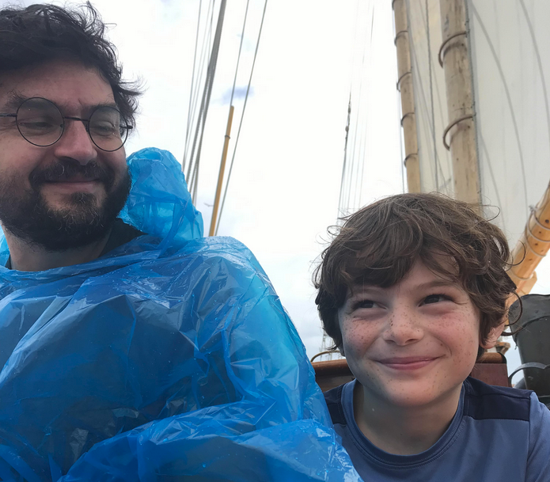

========================================================
Introduction to the Course
--------------------------

plot of chunk unnamed-chunk-1

Introduction to Datascience
========================================================
What is a Datascientist?
------------------------

"A datascientist is what you get when you take a statistician and remove reason
and accountability."

***

<small>
This is a mean way of saying that many data scientists come fron
non-statistical backgrounds and operate under circumstances where
rigor is not the top priority.

You all are lucky: you have the statistical foundation to be good data
scientists but may not have the technical background to navigate all the
tools of the trade that host and enable your work. 

This course's job is to introduce those tools to you.
</small>

What is a Data Scientist?
========================================================

plot of chunk unnamed-chunk-3

http://drewconway.com/zia/2013/3/26/the-data-science-venn-diagram

What is a Data Scientist?
========================================================

plot of chunk unnamed-chunk-4

http://drewconway.com/zia/2013/3/26/the-data-science-venn-diagram

There are things about statistics you will surely be shocked I don't know.

Data Scientist vs Statistician
========================================================

A statistician takes data, typically from a designed experiment (often the 
statistician is involved in the design) and produces particular sorts of
_answers_.

A data scientist takes "raw" data (which might be generated by some non-
experimental process like an application that uses a database) and generates
_questions._

Tasks data scientists do:
========================================================

1. Visualization
2. Exploratory Data Analysis
3. ETL (Extract, Transform, Load)
4. Application Development
5. Operations (setting up pipelines between databases and models)
6. Orchestrating Data Collection Standards
7. Lots else.

Scientific Research with Computers
========================================================

This course will also be useful for anyone doing research with 
computers. If you are doing non-trivial statistical analysis or simulation,
the methods we cover here will let you do so in an organized, portable,
comprehensible way.

Data Science Project Lifetime
=============================

Science is the orderly passage through this graph:

...

Data Science Project Lifetime
=============================

Science is the dis-orderly passage through this graph:

Good Data Science
=================

Elaboration
===========

We want to convert an ad-hoc, disordered, process into one in which
each phase is represented and each change is recorded along with
meaningful context.

Goofus
======

<small>
Goofus Presents Preliminary Results at BIOCON 2019 and publishes a
paper in 2021. A colleague asks why a large p-value (reported in 2019)
is much smaller in 2021.

Goofus just has a folder on his hard drive with a giant notebook in
it. He has a backup from late 2019 but has no idea what of the many
changes he has made since then changed the p-value. Also, he doesn't
have previous data set - having replaced it with an updated one.

</small>
***

plot of chunk unnamed-chunk-9

Gallant
=======

<small>
Gallant presented at the same conference and published in 2021 as
well. She (her first name is Alice) also had a p value reach significance between presentation
and publication. 

When Gallant is asked about it, she is able
to time travel back into her git repository and re-run her analysis to
reproduce the presentation result. She then writes a `git-bisect`
script and finds the exact commit where her p-value changed. The
commit message says "Modified outlier elimination to remove bad data
from this study."  She can provide a definitive answer!

</small>
***

plot of chunk unnamed-chunk-10

Not Just Version Control
========================

By far the most useful tool you'll learn here is Git. 

But you will also need these tools to make your work _really
reproducible_:

1. Unix Skills - tie everything together
2. Programming Skills - R and Python and Shell
3. Docker - reproducible development environments
4. Make - reproducible builds

Non-Tools
=========

Jupyter/RMarkdown

These are ok tools for exploratory work and quick write ups. I
encourage you to use them if you'd like. These slides are RMarkdown.

But they are bad tools for reproducible data science.

***

1. They obscure dependencies
2. They maintain a lot of global state
3. They discourage "factoring"
4. They impose a modest technical lock in 
5. They don't play well with git
6. They interleave _reporting_ with _processing_ and these are
   fundamentally disjoint tasks.
   
Analysis
========

While I'm hardly a statistician and you all probably know more than I
do, we will also cover:

1. Exploratory Data Analysis in R and Python
2. Processing, Joining and Cleaning Data
3. Visualization
4. Modeling (clustering, classification)

Things To Do Before Next Class
==============================

<small>
Visit these sites:

https://www.kaggle.com/
https://github.com/awesomedata/awesome-public-datasets

https://duckduckgo.com/?q=open+data+sets&t=newext&atb=v234-1&ia=web

</small>

Things to Try Before Next Class
===============================

<small>
1. Get a docker environment running. You should be able to do this in
   Windows or Linux or Mac. 
   https://docs.docker.com/get-started/
   On windows you can install Docker directly or install a Linux virtual
   Machine via Virtualbox. The latter is a bit more heavyweight a
   solution but will make your life easier in the long run.
    
2. Run a rocker/verse image.
   `docker run -e PASSWORD=yourpassword --rm -p 8787:8787 rocker/rstudio`
</small>

Course Material
===============

Located here:

https://github.com/Vincent-Toups/datasci611

Critical Things 1
=================

Technical work is unfortunately very detail oriented. Get used to reading
error and other messages very carefully. They  have good information and usually
tell you directly what the problem is or at least give you a good lead.

Critical Things 2
=================

There are a few really small things which screw up tons of people every year
and I'm going to have to talk about them maybe hundreds of times.

1. Quotation marks. ASCII defines single (') and double (") quotation marks.
Note that these quotation marks are symmetric: we use them to open and close 
quoted parts of some text "like this."

Unicode gives us an utter embarassment of quotation marks:  ‘’“”‛‟❛❜❝❞

While these are all picturesque in almost all technical contexts you will need
to use the ascii quotation marks.

Critical Things 3
=================

Pay attention to whitespace! There are tabs and spaces and newlines. These are
all "invisible" "   " but again often mean specific things in a technical
context. It will be useful to have a text editor that shows and color codes
whitespace.

Chat GPT
========

Go nuts, but consider:

<small><small>“Every extension of mankind, especially technological extensions, has the effect of amputating or modifying some other extension[…] The extension of a technology like the automobile ‘amputates’ the need for a highly developed walking culture, which in turn causes cities and countries to develop in different ways. The telephone extends the voice, but also amputates the art of penmanship gained through regular correspondence. These are a few examples, and almost everything we can think of is subject to similar observations…We have become people who regularly praise all extensions, and minimize all amputations.” --Marshall McLuhan</small>
Also consider: I find GPT3.5 to be almost uselessly dumb. Better to just learn
to program. But I am not banning GPT because it can't really do high level
data analysis, which is what this class is really about.</small>

***

Docker
======

The course is much more fun if you can install Docker on your personal computer
or laptop. This may not be easy for all of you (especially if you have Apple
Silicon). Everyone in the course can get a virtual machine for the semester
which will have Docker pre-installed. If you have an Apple Silicon machine or
just don't want to screw around with installing Docker on your laptop, email me
and I will set one up for you.

Projects
========

Don't sleep on your project. It is half your grade and also the best way to learn
the material (by applying it to your own work). Don't worry if you don't find
anything interesting. Reporting negative results is a very important skill and
you can always pivot to a new data set in search of more interesting stuff. 
Your project doesn't need to consist of just one type of data.

Homework
========

1. Pick a data set you might find interesting.

2. Write a pitch for your analysis (~500 words). What do you hope to
learn by looking at it in detail?

3.  

Submit a document to Canvas with:
- a picture of your face
- a phonetic pronunciation of your preferred name and pronouns
- something interesting about you (or something boring)

